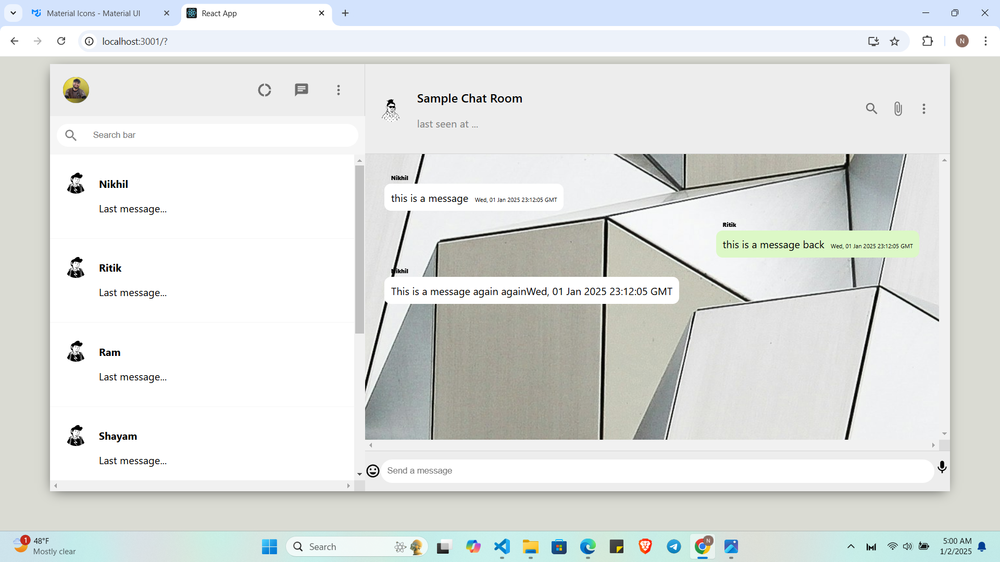

# ChatApp
# Objective
The Objective of this app is to give users a nice ,smooth and simple application for chatting with their friends.

# Application 

# Tech Stack
- I have used react for developing the front-end with java-script.
- For styling I have used simple CSS.
- and I have used Material UI library for Icons and other styling.

# Summary 
From the start my motive was to build a simple application where everyone can understand the flow of the things.
I have used react for developing the application. I have used css for styling. For icons and all I have used  Material UI that helped me for the icons, and giving the wrapper to them. I have used a free API endpoints for getting the random images for the application.
